# Web Application VAPT using Burp Suite and OWASP Juice Shop

## Project Overview
This project demonstrates manual Web Application Vulnerability Assessment and Penetration Testing on OWASP Juice Shop using Burp Suite Community Edition.

## Lab Setup
- Vulnerable Application: OWASP Juice Shop
- Tool: Burp Suite Community Edition
- Browser: Firefox
- Platform: VMware Workstation
- OS: Debian/Kali Linux

## Vulnerabilities Tested
- Authentication Testing
- SQL Injection
- Cross-Site Scripting (XSS)
- IDOR
- Broken Access Control
- Security Misconfiguration
- SSRF Testing
- API Enumeration

## Methodology
1. Configured Burp Suite proxy with Firefox.
2. Intercepted HTTP requests and responses.
3. Analyzed login, profile, basket, search, and API endpoints.
4. Used Burp Repeater for manual request manipulation.
5. Documented vulnerabilities with screenshots and remediation.

## Key Findings
### 1. Reflected XSS
A reflected XSS payload was tested in the search functionality.

### 2. IDOR
The basket endpoint was tested by modifying object identifiers in Burp Repeater.

### 3. Security Misconfiguration
The `/ftp` directory was publicly accessible and exposed backup/internal files.

### 4. API Documentation Exposure
Swagger API documentation was publicly accessible at `/api-docs`.

### 5. SSRF Testing
The profile image URL functionality was tested for SSRF. No confirmed SSRF vulnerability was identified.

## Tools Used
- Burp Suite Proxy
- Burp Repeater
- Firefox
- OWASP Juice Shop
- VMware Workstation

## Skills Learned
- HTTP request/response analysis
- Manual web application testing
- Burp Suite usage
- OWASP Top 10 testing
- API security testing
- Vulnerability documentation

## Disclaimer
This project was performed in a controlled lab environment using OWASP Juice Shop for educational purposes only.

# Screenshots

## 1. Burp Proxy Intercept
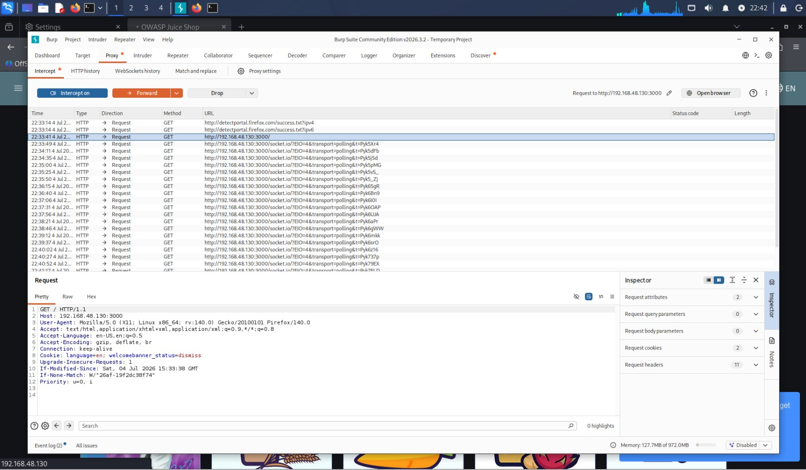

---

## 2. HTTP History
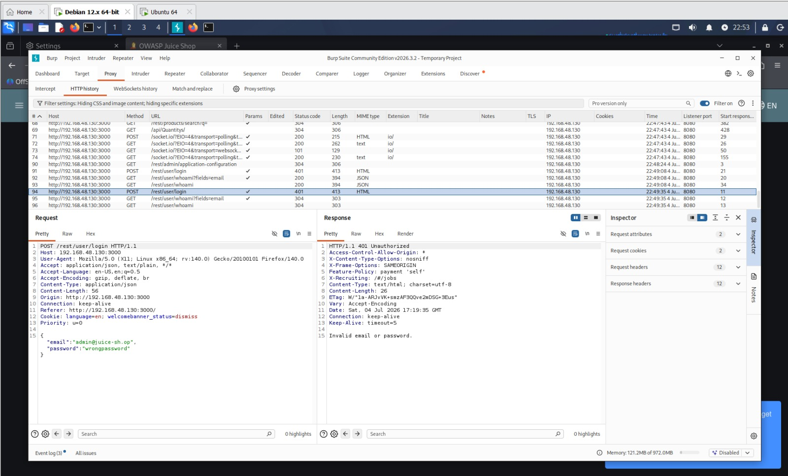

---

## 3. Failed Login (401 Unauthorized)
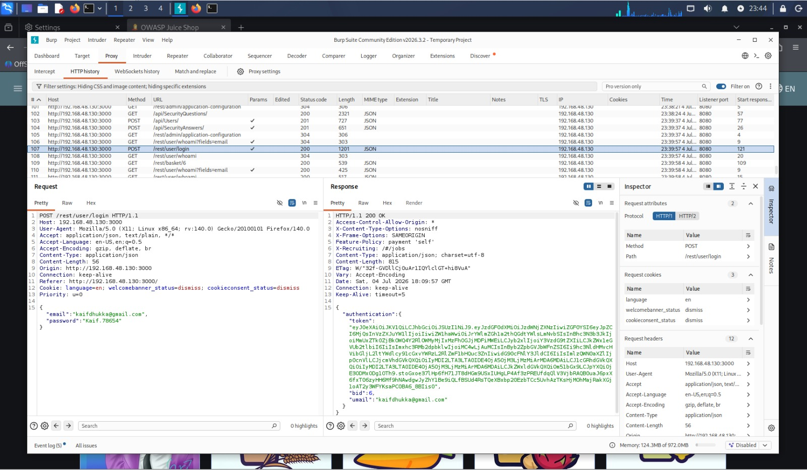

---

## 4. Successful Login (JWT Response)
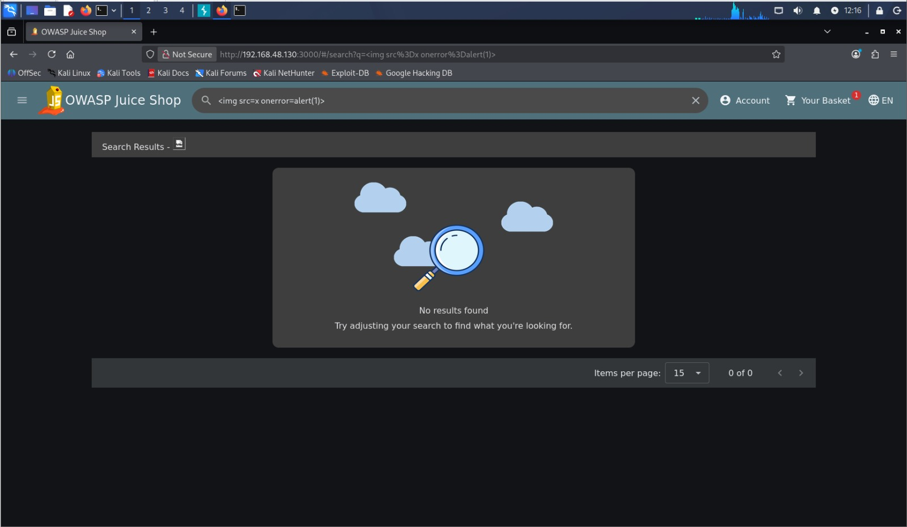

---

## 5. XSS Payload Injection
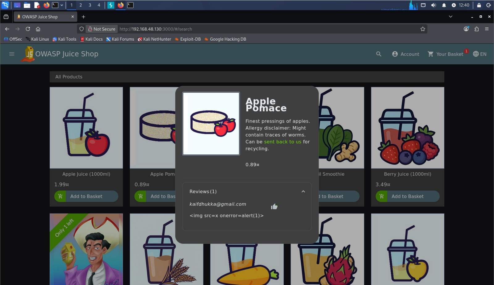

---

## 6. XSS Successfully Executed
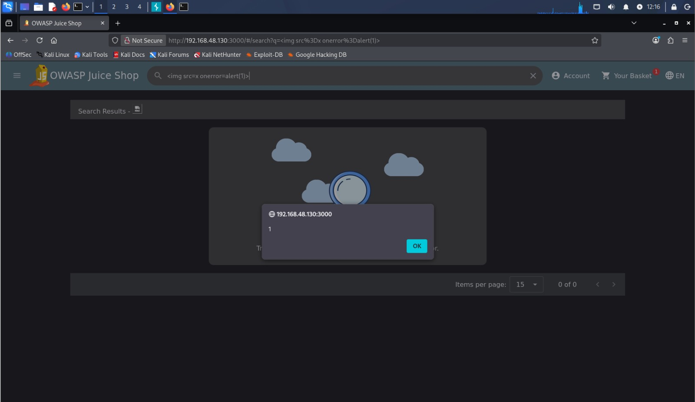

---

## 7. IDOR Request Manipulation
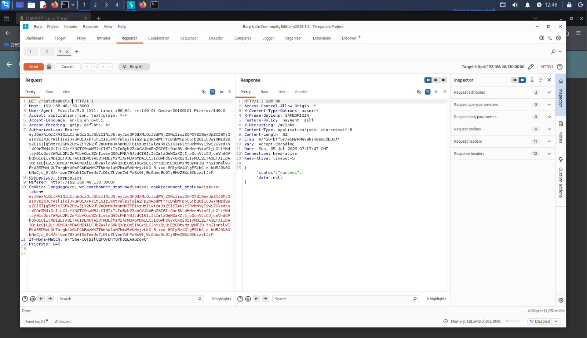

---

## 8. IDOR Response
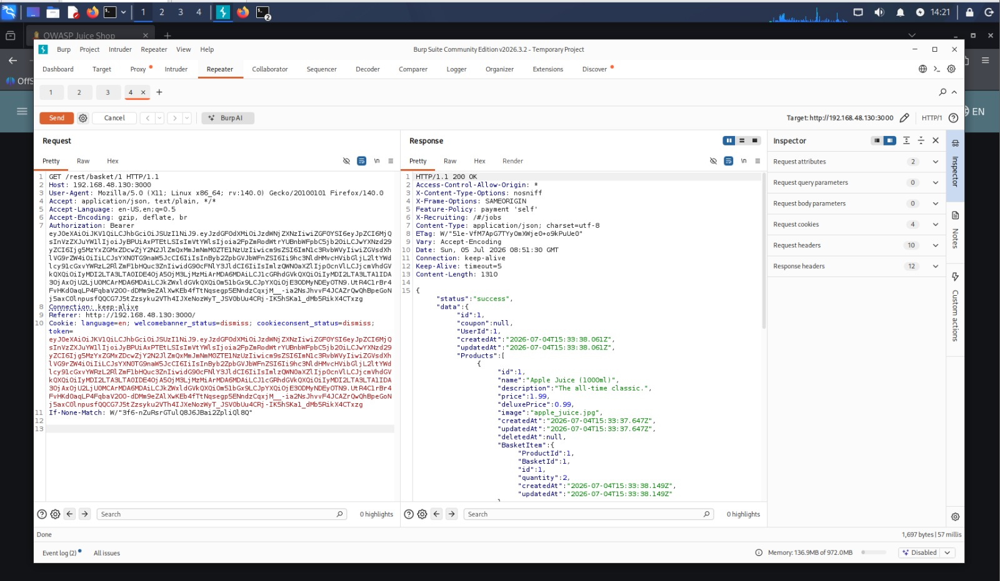

---

## 9. robots.txt Information Disclosure

---

## 10. Public FTP Directory Listing
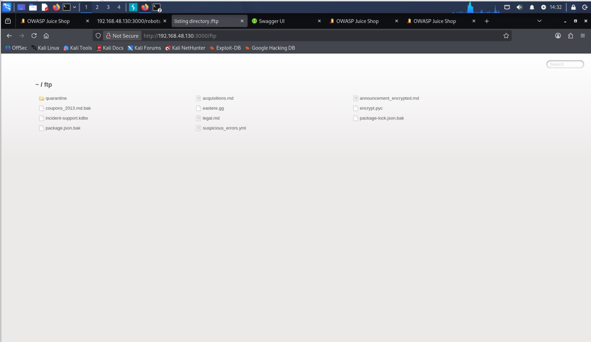

### FTP Exposed Files
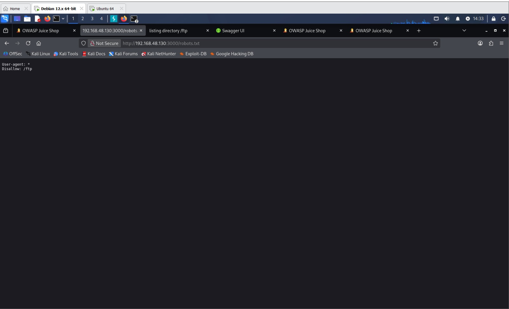

---

## 11. Swagger API Documentation Exposure
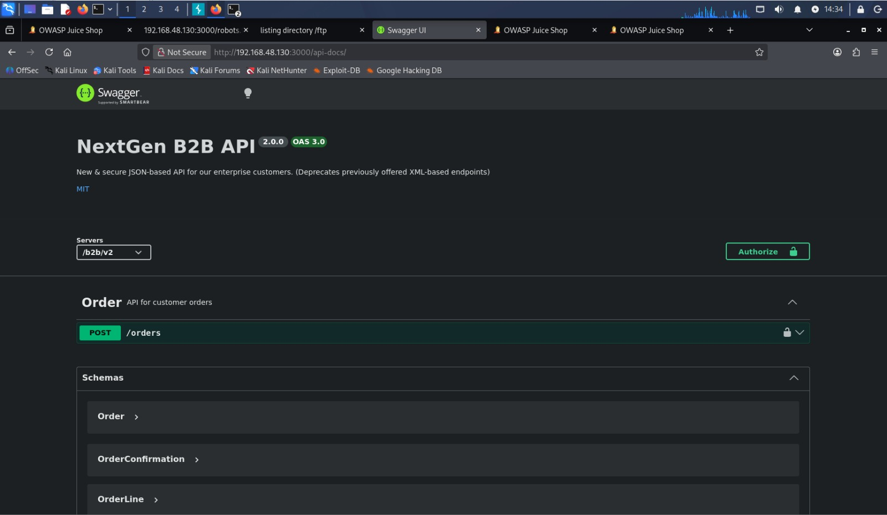

---

## 12. SSRF Image URL Request

---

## 13. SSRF Test Response (302 Redirect)

